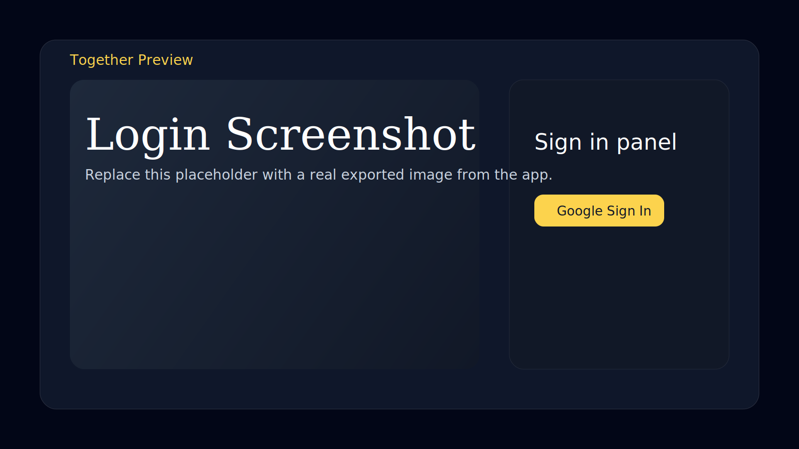
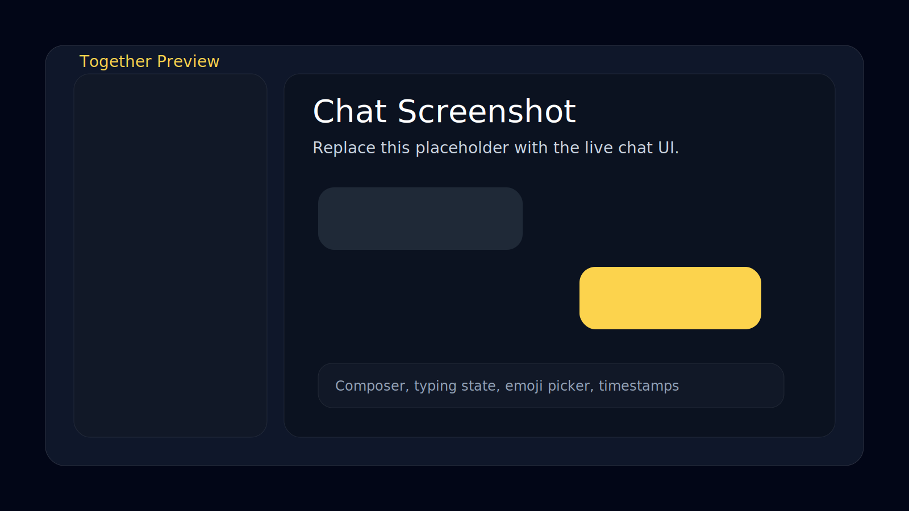
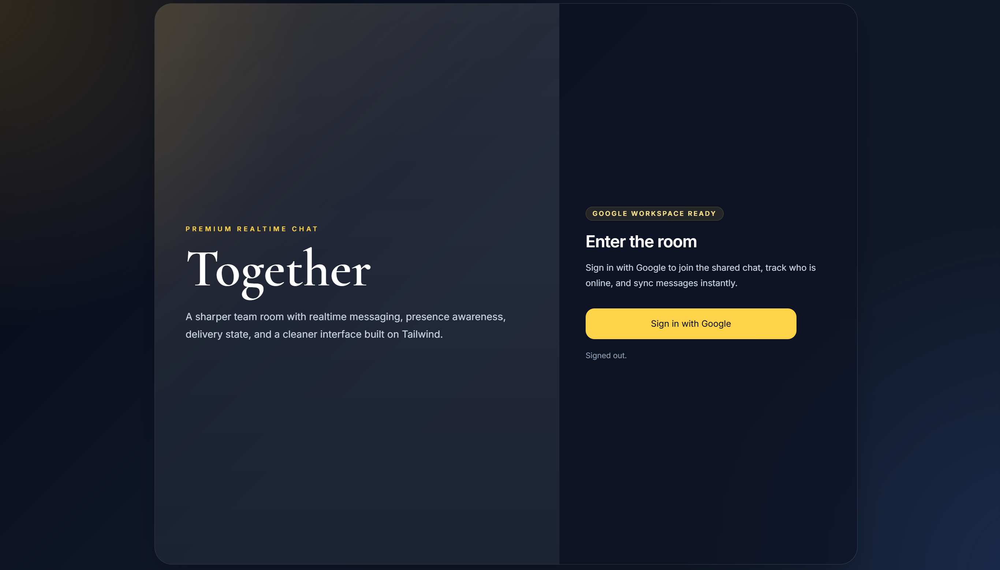
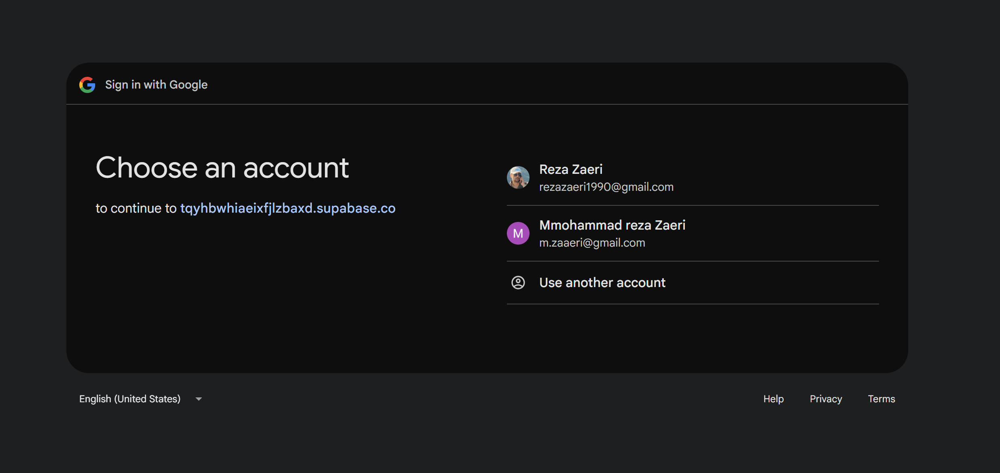
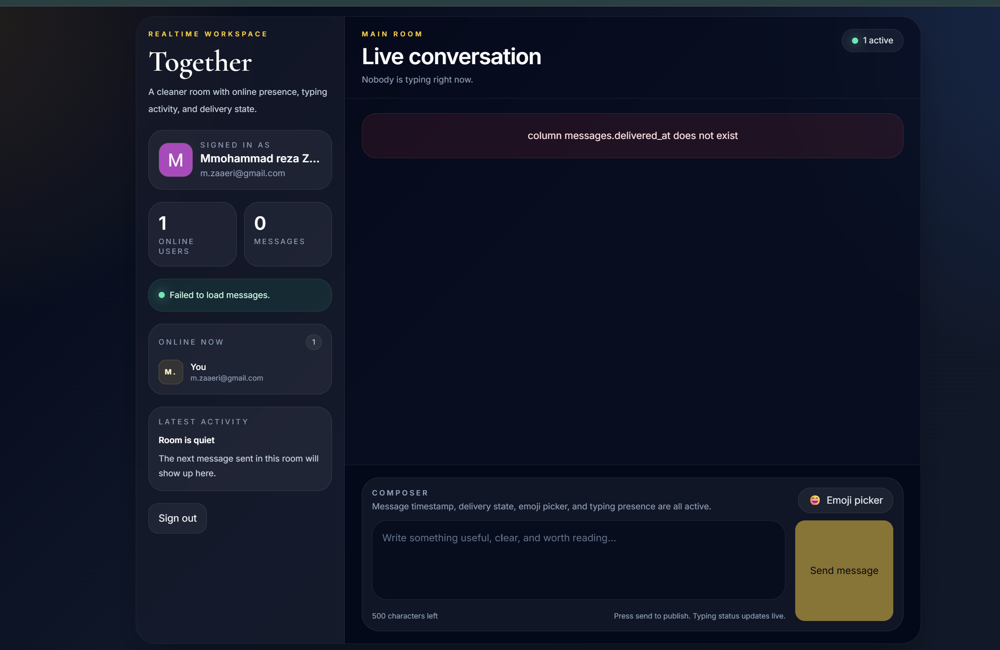

# Together

Together is a realtime chat room built with `React`, `Vite`, and `Supabase`. It uses Google login through Supabase Auth, syncs messages live, shows online presence, and includes a typing indicator for active conversations.

## Live Demo

Add your deployed app URL here:

`https://your-live-url-here`

## Screenshots

Replace these two paths with real project screenshots after exporting them from the running app:




## Features

- Google OAuth with Supabase Auth
- Realtime message stream
- Online presence tracking
- Typing indicator
- Quick emoji bar
- Loading, empty, error, and config-safe states
- Responsive production-ready UI

## Run Locally

1. Install dependencies:

```bash
npm install
```

2. Create a `.env` file from `.env.example`:

```bash
cp .env.example .env
```

3. Fill in your Supabase project values:

```env
VITE_SUPABASE_URL=your-project-url
VITE_SUPABASE_ANON_KEY=your-anon-key
```

4. Run the SQL schema inside Supabase:

File: `supabase/messages.sql`

5. Start the app:

```bash
npm run dev
```

## Scripts

```bash
npm run dev
npm run build
npm run lint
npm run preview
```

## 📸 Screenshots





## Database

The `messages` table is configured with these fields:

- `id`
- `user_id`
- `email`
- `avatar_url`
- `body`
- `created_at`

RLS policies are enabled so that:

- authenticated users can read messages
- users can only insert messages for themselves

## Notes

- The UI currently limits each message to `500` characters.
- `src/lib/supabase.js` is the main client configuration file.
- If environment variables are missing, the app shows a setup state instead of crashing.
